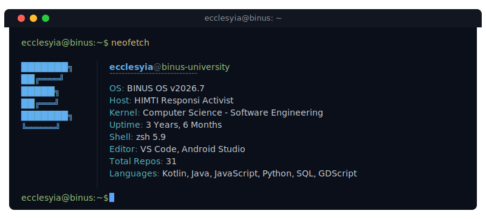

  

  

---

## Repository History

The table below shows the distribution of public repositories created per year:

<!-- START_SECTION:dynamic_stats -->
| Year | Repositories Created |
| :--- | :--- |
| 2026 | 19 |
| 2025 | 3 |
| 2024 | 3 |
| 2023 | 6 |
<!-- END_SECTION:dynamic_stats -->

---

## GitHub Stats

  

  

---

## Tools and Technologies

  

---

## Connect

  
  
  
  
  

