<!-- Generated by GitHub Profile Agent Console. Edit profile.config.json, then run npm run generate. -->

  <picture>
    <source media="(max-width: 760px) and (prefers-color-scheme: dark)" srcset="./assets/hero/agent-console-93bf8d0d-mobile-dark.svg">
    <source media="(max-width: 760px)" srcset="./assets/hero/agent-console-93bf8d0d-mobile-light.svg">
    <source media="(prefers-color-scheme: dark)" srcset="./assets/hero/agent-console-93bf8d0d-dark.svg">
    <source media="(prefers-color-scheme: light)" srcset="./assets/hero/agent-console-93bf8d0d-light.svg">
    
  </picture>

  

  

## About Me

I am a Computer Science student at BINUS University specializing in Software Engineering.

I work as a HIMTI Responsi Activist, helping fellow students learn the fundamental in college.

## Current Focus

| Area | What I am exploring |
| --- | --- |
| **Software Engineering** | Designing, developing, testing, and maintaining clean and robust software systems. |
| **Full Stack Developer** | Building responsive web applications, interactive frontends, and reliable backend APIs. |
| **Game Development** | Exploring game engines, mechanics, physics, and scripting workflows (e.g. GDScript in Godot). |
| **Passionate Projects** | Creating tools, bots, and fun open-source applications that solve real needs (e.g., Discord bots). |

## Featured Work

| Project | Focus | Why it matters |
| --- | --- | --- |
| [**portofolio**](https://github.com/ecclesyia/portofolio) | Portfolio Site | A website of tracking and as a portfolio for me and sharing the thing that I had made in the past. [Live](https://ecclesyia.netlify.app) |
| [**ecclesyia**](https://github.com/ecclesyia/ecclesyia) | Profile Config | Dynamic, terminal-style profile README configurations. |

## Research Direction

I am focused on understanding systems architecture, programming paradigms, and structural project design to build robust software systems.

## Tech Stack

`Kotlin` · `Java` · `JavaScript` · `Python` · `SQL` · `GDScript`

## Recent Activity

<!-- AUTO:ACTIVITY:START -->
_Recent public activity will appear here after the workflow runs._
<!-- AUTO:ACTIVITY:END -->

---

## Repository History

The table below shows the distribution of public repositories created per year:

| Year | Repositories Created |
| :--- | :--- |
| 2026 | 19 |
| 2025 | 3 |
| 2024 | 3 |
| 2023 | 6 |

## GitHub Stats

  

  

## Tools and Technologies

  

## Connect

  
  
  
  
  

---

  Building thoughtful systems and sharing what works.

