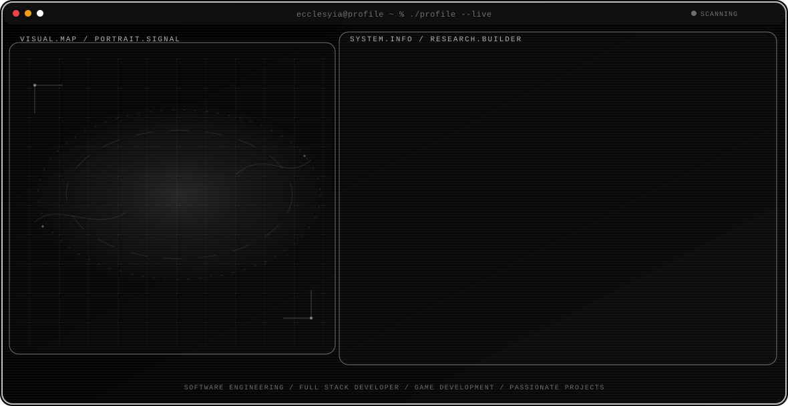

<!-- Generated by GitHub Profile Agent Console. Edit profile.config.json, then run npm run generate. -->

  

  <picture>
    <source media="(max-width: 760px) and (prefers-color-scheme: dark)" srcset="./assets/hero/agent-console-78d4c715-mobile-dark.svg">
    <source media="(max-width: 760px)" srcset="./assets/hero/agent-console-78d4c715-mobile-light.svg">
    <source media="(prefers-color-scheme: dark)" srcset="./assets/hero/agent-console-78d4c715-dark.svg">
    <source media="(prefers-color-scheme: light)" srcset="./assets/hero/agent-console-78d4c715-light.svg">
    
  </picture>

  

  

  

  
  

  <picture>
    <source media="(prefers-color-scheme: dark)" srcset="./assets/snake/github-contribution-grid-snake-dark.svg">
    <source media="(prefers-color-scheme: light)" srcset="./assets/snake/github-contribution-grid-snake.svg">
    
  </picture>

<b>Tools and Technologies</b>

  

<b>Connect</b>

    

---

  "Dying is easy, young man. Living is harder." - George Washington
  "Legacy. What is a legacy? It's planting seeds in a garden you never get to see." - Alexander Hamilton

